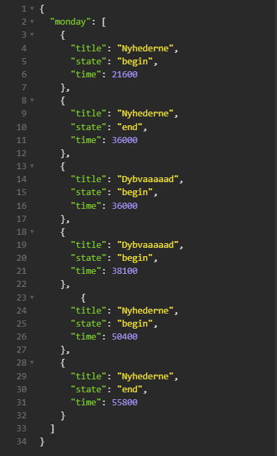
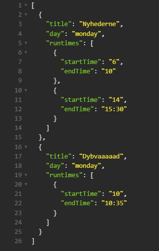

# TV2BackendExerciseEPG
TV2 Backend Exercise - Electronic Program Guide

## Part 1: Create a webservice
For this exercise, I have decided to use Nest to easily and conveniently set up a HTTP service.

Install the required dependencies before running the service:
```bash
$ npm install
```

Start the service with:
```bash
$ npm run start
```
Send a POST request to:
```
http://localhost:3000/epg/parse
```
with the JSON formatted program guide in the request body. The service will then respond with a string containing the human readable program guide.
### Testing
I also wrote tests for this, testing two test cases:
- 1: Only parse one day's program
- 2: Parse the full week program provided in the exercise

To run the test, use:
 ```bash
$ npm run test:e2e
```
You can read the test specification in: /test/app.e2e-spec.ts
### Building and Deployment

I have created both Dockerfile and docker-compose file for this service for easy building and deployment.

Build service with docker build
> Note: the Dockerfile requires a npm auth token to be able to install node packages
 ```bash
$ docker build -t epgparser --build-arg NPM_TOKEN=< YOUR NPM TOKEN HERE > .
```

Or Build with docker compose:
> Note: the NPM_TOKEN variable needs to be set as a environment variable before running this compose build. Otherwise the token can be placed in the docker compose file as a build argument for the service.
 ```bash
$ env NPM_TOKEN=< YOUR NPM TOKEN HERE > docker compose build
``` 


Run service with docker compose:
 ```bash
$ docker compose up -d 
```

## Part 2: My thoughts on the input data model
I would change the input model, such that each show instance or runtime (begin state and end state pair) would be one object. Each of those objects should then contain both the start time and the end time, such that it becomes one block. I assume that no program will ever overlap with one another, so those two list entries containing start time and end time might as well be one entry containing both times. I would also include the information on the program start day.

There are two significant parts of my service implementation. First, I iterate through the input list to create show objects and join the runtimes in one list under the show's data, if it occurs more than once a given day. Then I parse the new show object array to human readable text.

Seen in the two pictures below is the original format for monday (Left), and the way my service is parsing the list, before making it human readable (Right). In this implementation, each show contains the title, the starting day, and a list of runtimes for that day.

| Original input format |  My rendition of the program list |
|-----------------------|----------------------------------|
|| |


## Author

- Author - Andreas Andersen
## Nest License

Nest is [MIT licensed](LICENSE).
